# Child Vaccination Reminder System

## Overview

The **Child Vaccination Reminder System** is a web application designed to help hospitals and parents keep track of child vaccinations and Reminding the upcomming vaccination dates. The system allows hospitals to manage vaccines, view upcoming vaccinations, and maintain records of children. Parents can log in to view their child's vaccination schedule and logs.

## Features

### Hospital Role:
- **Login**: Secure login for hospital staff.
- **Add/View/Update/Delete Vaccine**: Manage vaccines including adding, viewing, updating and deleting vaccine records.
- **Add/View/Update/Delete Child**: Manage child records in the system.
- **Add/View/Update/Delete VaccineLog**: Manage child records in the system.
- **View Upcoming All Child Vaccines**: View all child vaccinations due in the next 30 days.
- **Change Password**: Secure password management for hospital staff.

### Child Role:
- **Login**: Secure login for parents.
- **View Vaccines**: View the list of available vaccines.
- **View Upcoming Own Child Vaccines**: View upcoming vaccines due for their own child within the next 30 days.
- **View Own Child Vaccines Log**: View vaccination logs for their own child.
- **Change Password**: Secure password management for parents.

## Technology Stack

- **Frontend**: HTML, CSS
- **Backend**: Java, Servlet, JSP
- **Database**: MySQL, Hibernate ORM
- **Build Tool**: Maven

## Screenshots

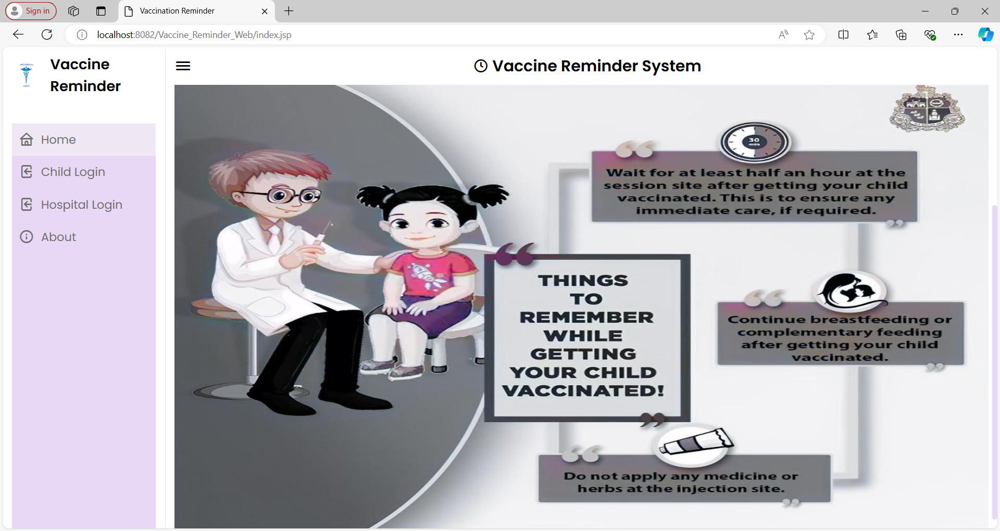

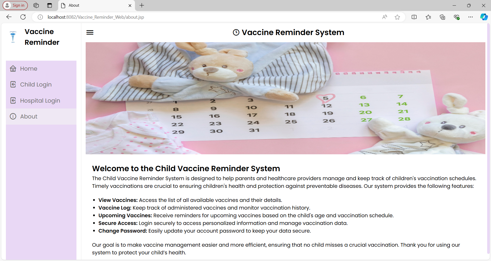

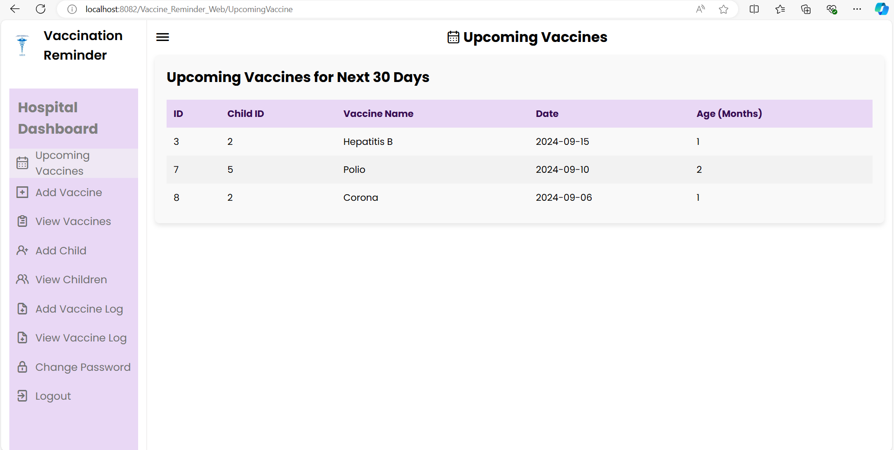

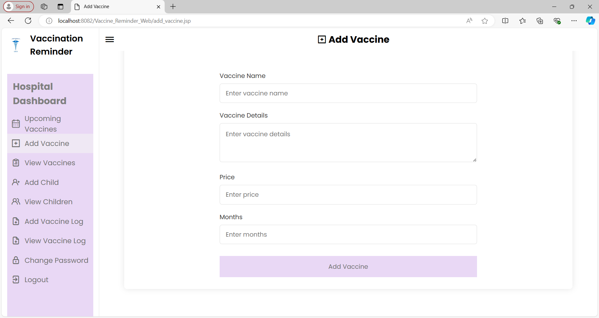

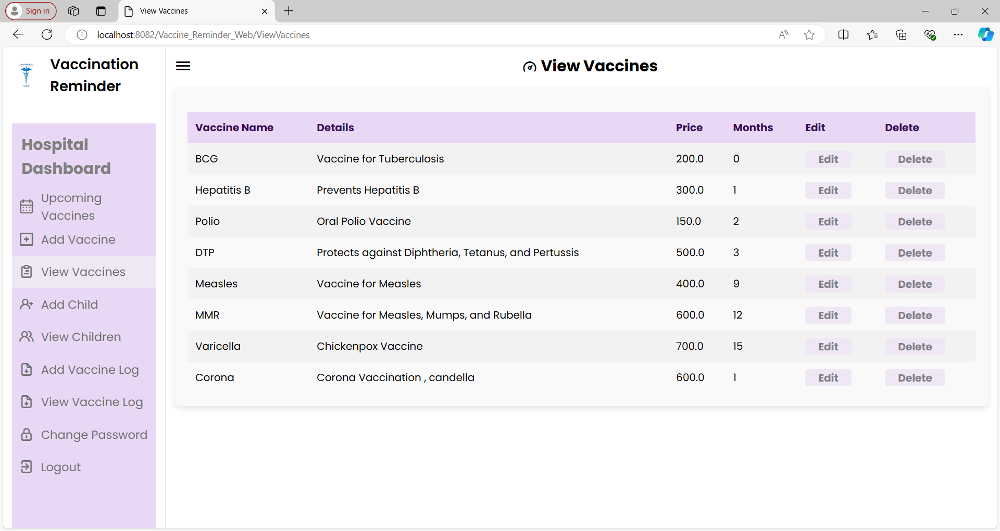

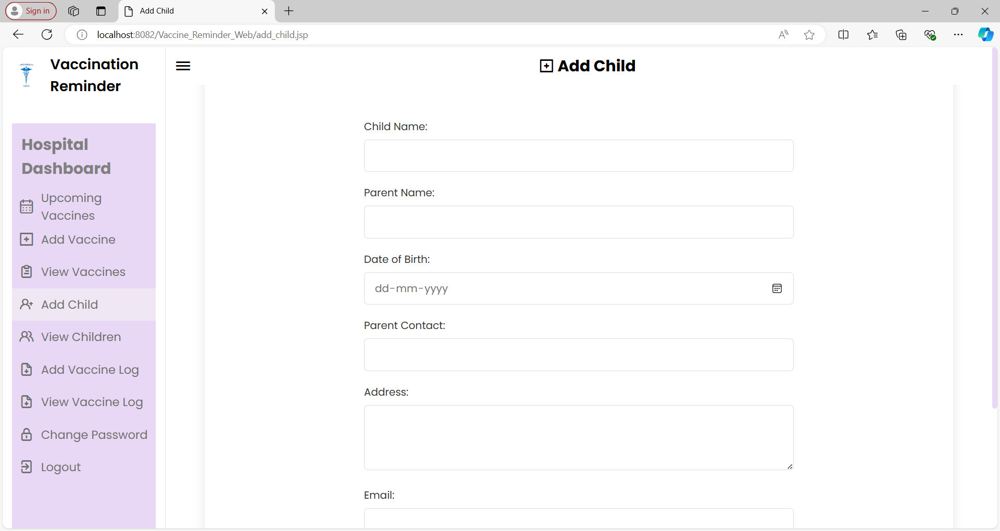

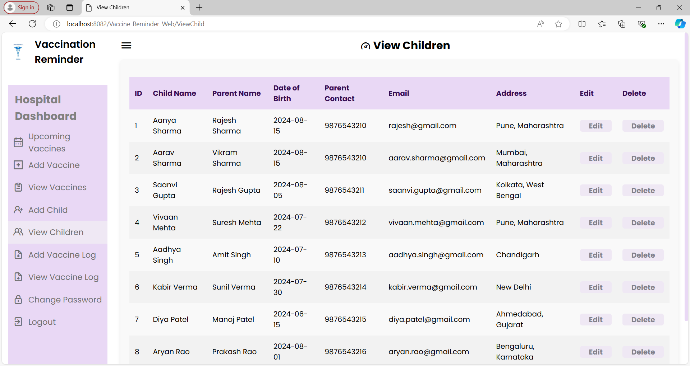

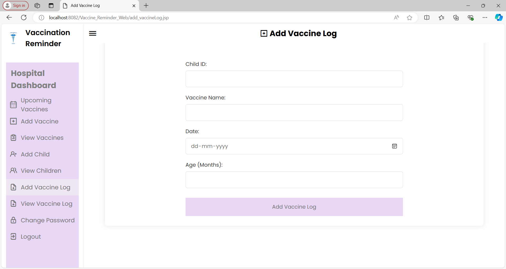

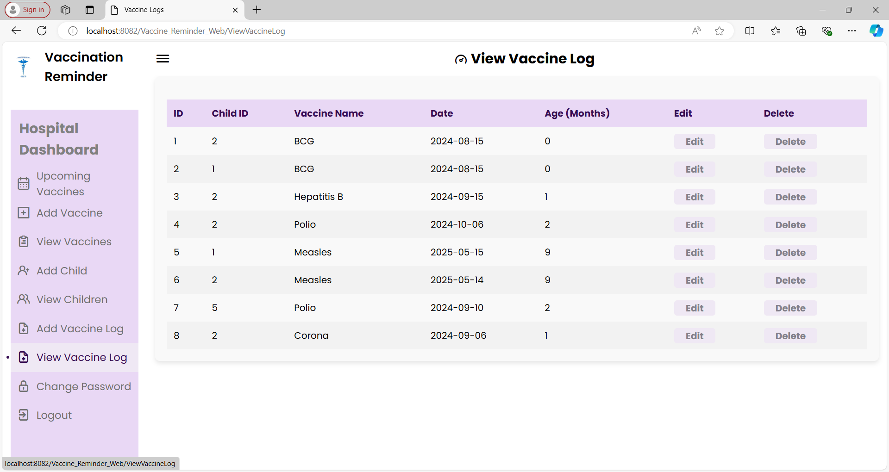

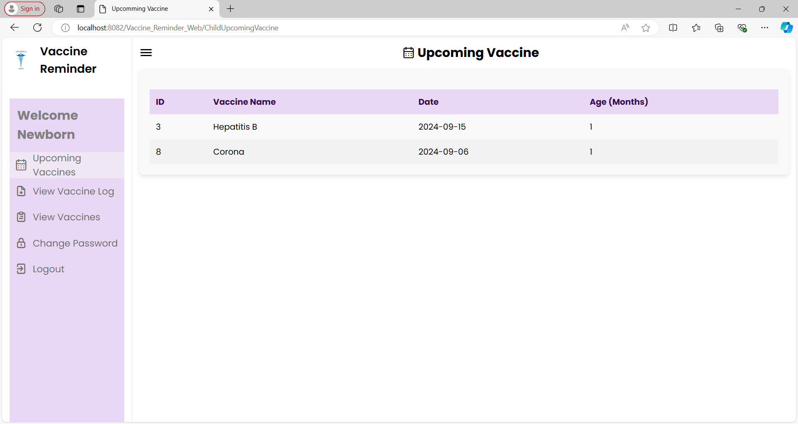

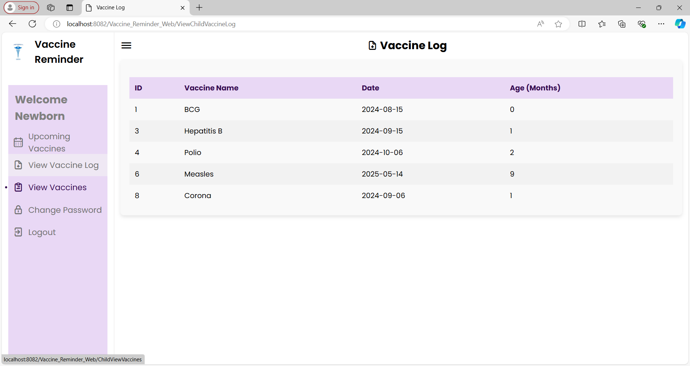

